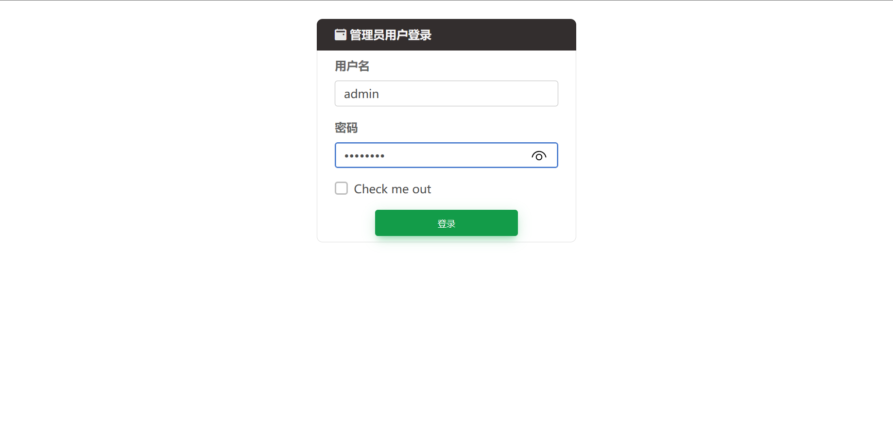
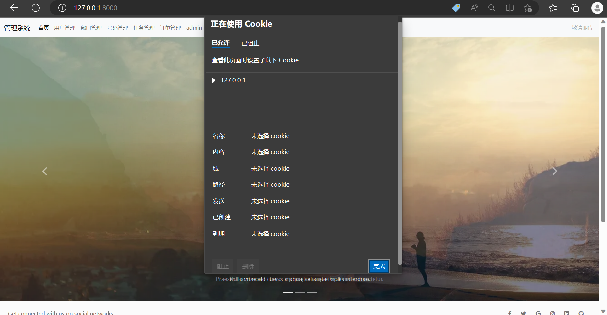
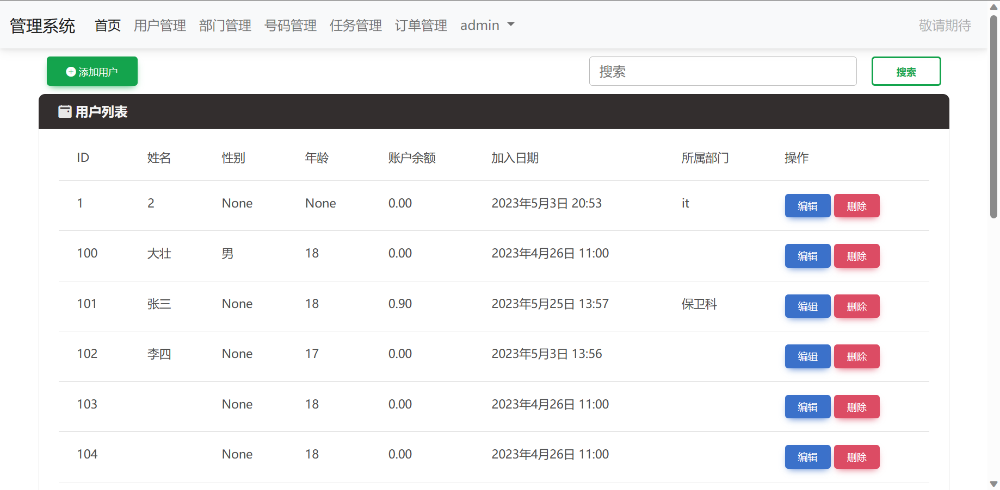
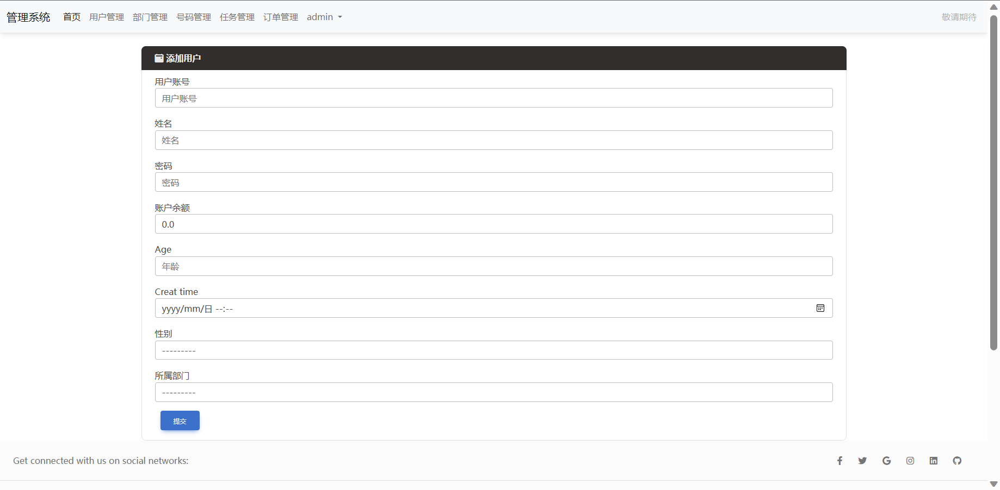
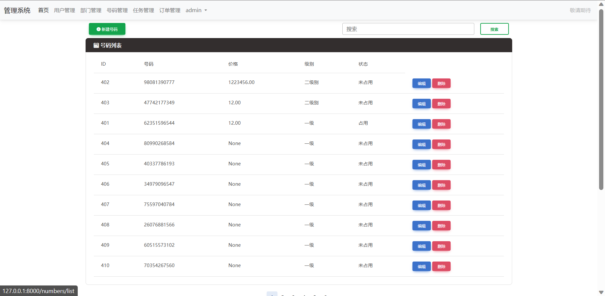
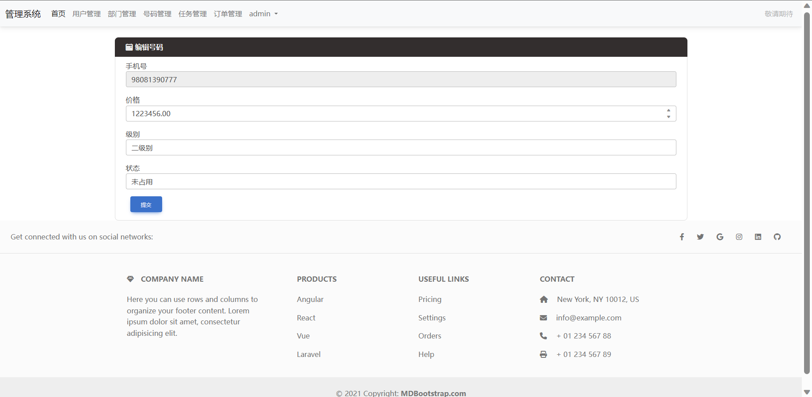
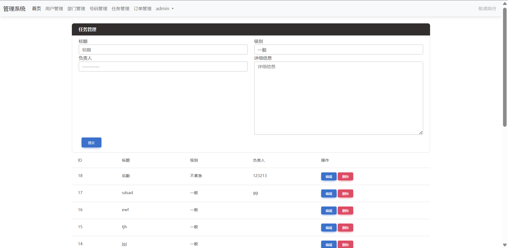

# django_management_system_template

基于Django的管理系统模板。前端，Web应用，mysql数据库。

[个人网站：www.bytesc.top](http://www.bytesc.top)

## 界面展示

首页


登录


使用 cookie 保存登录状态。未登录的用户只能访问首页和登录页面。否则重定向到登录页面。


用户管理


添加用户


部门管理


号码管理


编辑号码


任务管理


## 使用方法

安装依赖
```bash
pip install -r requirement.txt
```

打开 setting.py，找到83行左右。

如果使用 mysql 就使用下面一个 DATABASES，把上面的注释掉。
在里面填写自己 mysql 服务器的 `'USER'`，`'PASSWORD'`，`'HOST'`，`'PORT'`。
手动创建和 `'NAME'` 字段内容同名的数据库

如果使用 sqlite 就使用上面一个 DATABASES，把下面的注释掉即可。

```python
# Database
# https://docs.djangoproject.com/en/4.1/ref/settings/#databases

# DATABASES = {
#     "default": {
#         "ENGINE": "django.db.backends.sqlite3",
#         "NAME": BASE_DIR / "db.sqlite3",
#     }
# }

DATABASES = {
    'default': {
        'ENGINE': 'django.db.backends.mysql',
        'NAME': 'djangolearntest',
        'USER': 'root',
        'PASSWORD': '123456',
        'HOST': '127.0.0.1',
        'PORT': '3306',
    }
}
```

初始化数据库
```bash
python manage.py makemigrations
python manage.py makemigrate
```

进入django shell
```bash
python manage.py shell
```

手动添加管理员
```python
import app01.models
app01.models.MyAdmin.objects.create(id="admin", user_name="admin", password="9b7bdac3cbd4af86551d5f27d64a5291")
exit()
```

运行
```bash
python manage.py runserver
```
如果默认 8000 端口被占用，换端口即可
```bash
python manage.py runserver 8008
```

登录用户名是`admin`，密码是`12345678`


## 项目结构

```txt
.
│  .gitignore
│  cmd.txt
│  guide.md
│  LICENSE
│  manage.py
│  README.md
│  requirement.txt
├─app01
│  │  admin.py
│  │  apps.py
│  │  models.py
│  │  tests.py
│  │  views.py
│  │  __init__.py
│  │
│  └─ middle_ware
│     └─ my_auth.py
├─srcs
│  │  ├─forms
│  │  │  └─ form.py
│  │  │
│  │  └─views
│  │         account.py
│  │         departments.py
│  │         myadmin.py
│  │         number.py
│  │         order.py
│  │         task.py
│  │         user.py
│  ├─static
│  │
│  ├─templates
│  │  │  change.html
│  │  │  error.html
│  │  │  index.html
│  │  │  layout.html
│  │  │
│  │  ├─account
│  │  │      login.html
│  │  │
│  │  ├─departments
│  │  │      depart_add.html
│  │  │      depart_edit.html
│  │  │      depart_list.html
│  │  │
│  │  ├─myadmin
│  │  │      myadmin_list.html
│  │  │
│  │  ├─numbers
│  │  │      num_add.html
│  │  │      num_edit.html
│  │  │      num_list.html
│  │  │
│  │  ├─order
│  │  │      order_list.html
│  │  │
│  │  ├─task
│  │  │      task_list.html
│  │  │
│  │  └─users
│  │          user_add.html
│  │          user_edit.html
│  │          user_list.html
│  │
│  └─ utils
│    bootstrap_modelform.py
│    md5.py
│    page_nav.py
│
├─Learntest
│     asgi.py
│     settings.py
│     urls.py
│     wsgi.py
│
└─ readme_img
```
